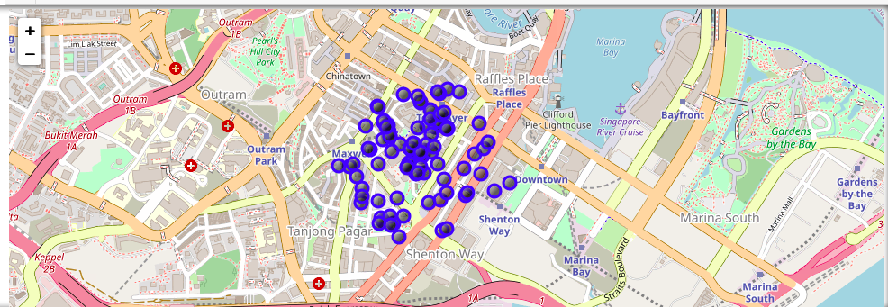
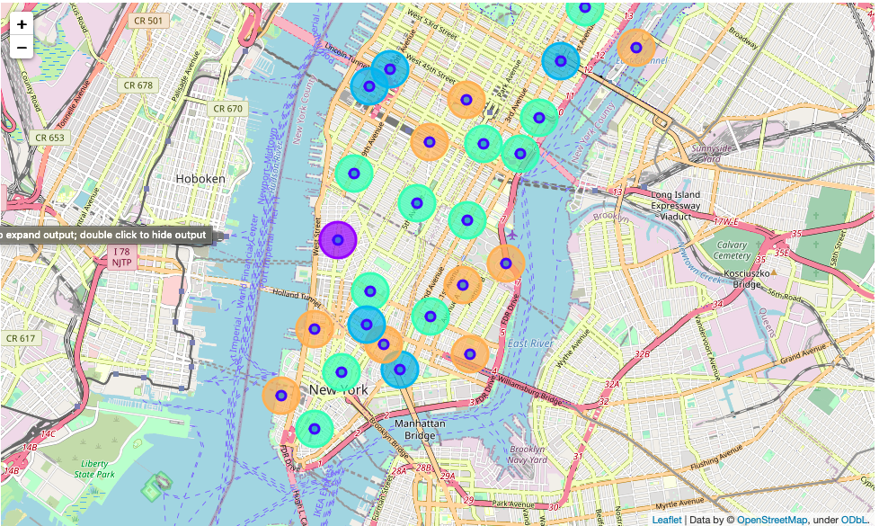
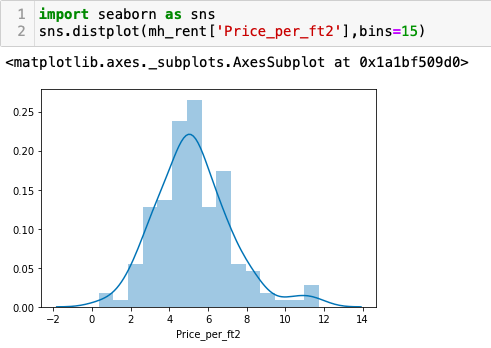
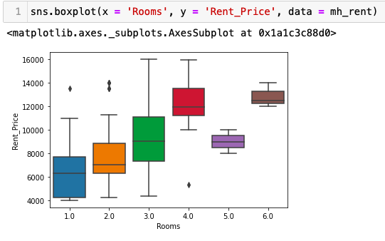
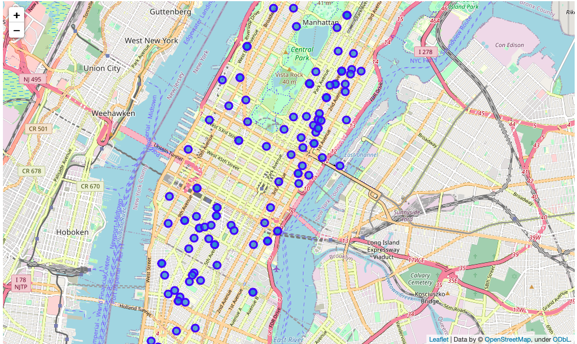
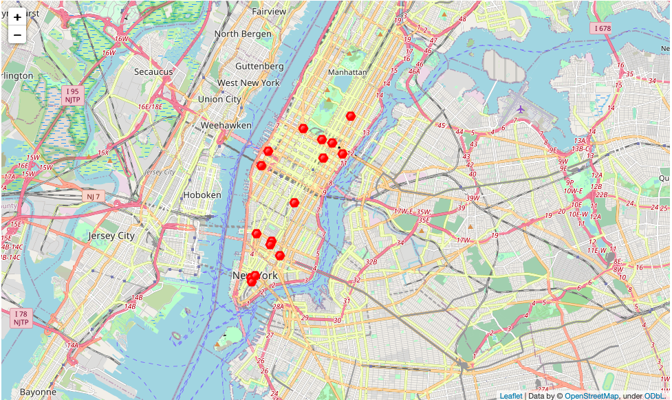
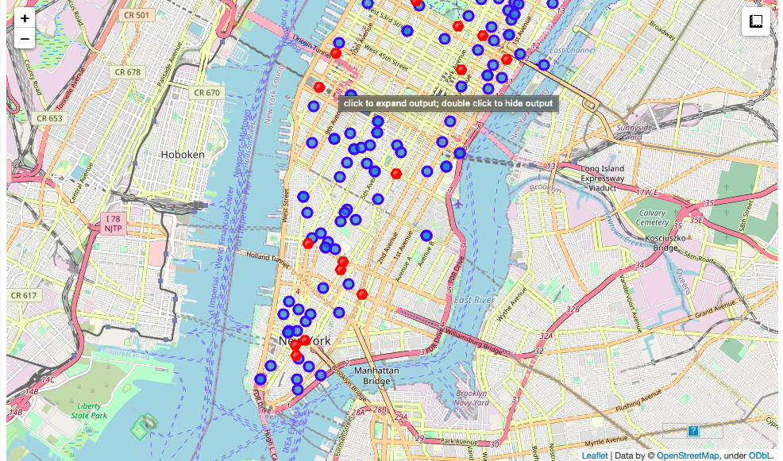

Capstone Project- The Battle of Neighborhoods
========================================================
author: Kevil Khadka
date: Auguest 14, 2020
autosize: true

Introduction
========================================================
The major purpose of this project, is to suggest a better apartment, neighborhood in a new city for the person who are shifting there. Social presence in society in terms of like minded people. Connectivity to the airport, bus stand, city center, markets and other daily needs things nearby.

The key question is:    
How can we find a convenient and enjoyable place similar to current you are living? Certainly, We can use available real estate apps and Google but the idea is to use and apply the learned tools during the course. In order to make a comparison and evaluation of the rental options in Manhattan NY, we must set some basis, therefore the apartment in Manhattan must meet the following demands:

Data Description
========================================================
The following data is required to answer the issues of the problem:

1. List of Boroughs and neighborhoods of Manhattan with their geodata (latitude and longitude)    
2. List of Subway metro stations in Manhattan with their address location   
3. List of apartments for rent in Manhattan area with their addresses and price   
4. Preferably, a list of apartment for rent with additional information, such as price, address, area, numbers of beds, etc    
5.Venues for each Manhattan neighborhood ( than can be clustered)   
6. Venues for subway metro stations, as needed   

Methodology
========================================================

The tools described are used here and the Notebook cells indicates the execution of steps. The processing of these data will allow to answer the key questions to make a decision:

1. What is the cost of rent (per square ft) around a mile radius from each subway metro station?   
2. What is the area of Manhattan with best rental pricing that meets criteria established?    
3. What is the distance from work place ( Park Ave and 53 rd St) and the tentative future home?    
4. What are the venues of the two best places to live? How the prices compare?    
5. How venues distribute among Manhattan neighborhoods and around metro stations?   
6. Are there trade-offs between size and price and location?    
7. Any other interesting statistical data findings of the real estate and overall data.   

Analysis
========================================================

Venues near current Singapore residence place   

Data and Mapping
========================================================

========================================================
Manhattan Borough neighborhoods - Dataset with top 10 clustered venues

Map of Manhattan Neighborhoods with Top 10 Clustered venues

========================================================

Manhattan Apartment Rent Price Statistics

    
    
   

========================================================
Map of Manhattan Apartments for Rent

The big bubble on map indicate the address and the monthly price for rent thus making it convenient to select the target apartment with the price condition stipulated (max US7000).    

  

========================================================
Map of Manhattan: Places for Rent and the Cluster of Venues

Now, one can point to a rental place for price and address location information while knowing the cluster venues around it. This is an insightful way to explore rental possibilities.

  

========================================================
Map of Manhattan: The Location of Subway Stations

  

========================================================
Map of Manhattan: Places for Rent and the Subway Locations Nearby

 

Results
========================================================

Let's consolidate all the required information to make the apartment selection in one map.

Map of Manhattan with Rental Places, Subway Locations and Cluster of Venues

Red dots are Subway stations, Blue dots are apartments available for rent, Bubbles are the clusters of venues.   

 

Conclusion
========================================================
This project has shown me a practical application to resolve a real situation that has impacting personal and financial impact using Data Science tools.

The mapping with Folium is a very powerful technique to consolidate information and make the analysis and decision thoroughly and with confidence.
