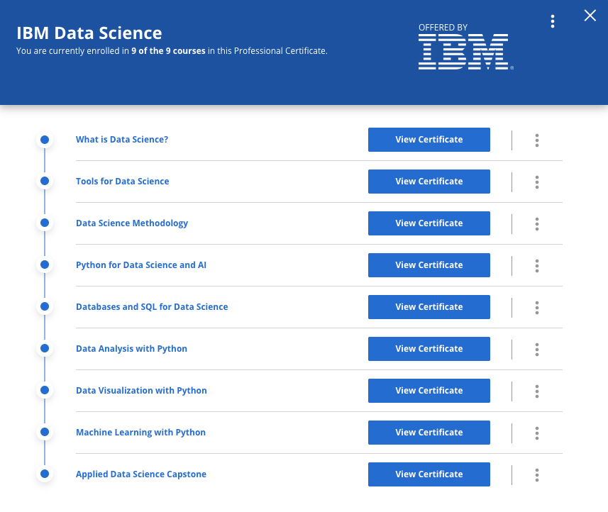

# [IBM Data Science](https://www.youracclaim.com/badges/0a4d32de-f466-45f6-a965-21bbc9603b80/public_url)

## Course Info:   

## Course 1: [What is Data Science?](https://github.com/kk289/IBM-Data-Science/tree/master/Course%201_What%20is%20Data%20Science%3F)       
Taught by:    
Alex Aklson, Ph.D., Data Scientist, IBM Developer Skills Network    
Polong Lin, Data Scientist, IBM Developer Skills Network    

## Course 2: [Tools for Data Science](https://github.com/kk289/IBM-Data-Science/tree/master/Course%202_Tools%20for%20Data%20Science%20)    
Taught by:    
Romeo Kienzler, Chief Data Scientist, Course Lead, IBM Watson   
Svetlana Levitan, Senior Developer Advocate with IBM Center for Open Data and AI Technologies    

## Course 3: [Data Science Methodology](https://github.com/kk289/IBM-Data-Science/tree/master/Course%203_Data%20Science%20Methodology)    
Taught by:    
Alex Aklson, Ph.D., Data Scientist, IBM Developer Skills Network    
Polong Lin, Data Scientist, IBM Developer Skills Network    

## Course 4: [Python for Data Science and AI](https://github.com/kk289/IBM-Data-Science/tree/master/Course%204_Python%20for%20Data%20Science%20and%20AI)    
Taught by:    
Joseph Santarcangelo, Ph.D., Data Scientist at IBM, IBM Developer Skills Network    

## Course 5: [Databases and SQL for Data Science](https://github.com/kk289/IBM-Data-Science/tree/master/Course%205_Databases%20and%20SQL%20for%20Data%20Science)    
Taught by:    
Rav Ahuja, AI and Data Science Program Director, IBM    

## Course 6: [Data Analysis with Python](https://github.com/kk289/IBM-Data-Science/tree/master/Course%206_Data%20Analysis%20with%20Python)   
Taught by:       
Joseph Santarcangelo, Ph.D., Data Scientist at IBM, IBM Developer Skills Network    

## Course 7: [Data Visualization with Python](https://github.com/kk289/IBM-Data-Science/tree/master/Course%207_Data%20Visualization%20with%20Python)      
Taught by:    
Alex Aklson, Ph.D., Data Scientist, IBM Developer Skills Network        

## Course 8: [Machine Learning with Python](https://github.com/kk289/IBM-Data-Science/tree/master/Course%208_Machine%20Learning%20with%20Python)      
Taught by:    
Saeed Aghabozorgi, Ph.D., Sr. Data Scientist, IBM Developer Skills Network    
Joseph Santarcangelo, Ph.D., Data Scientist at IBM, IBM Developer Skills Network    

## Course 8: [Applied Data Science Capstone](https://github.com/kk289/IBM-Data-Science/tree/master/Course%209_Applied%20Data%20Science%20Capstone)      
Taught by:    
Alex Aklson, Ph.D., Data Scientist, IBM Developer Skills Network    

